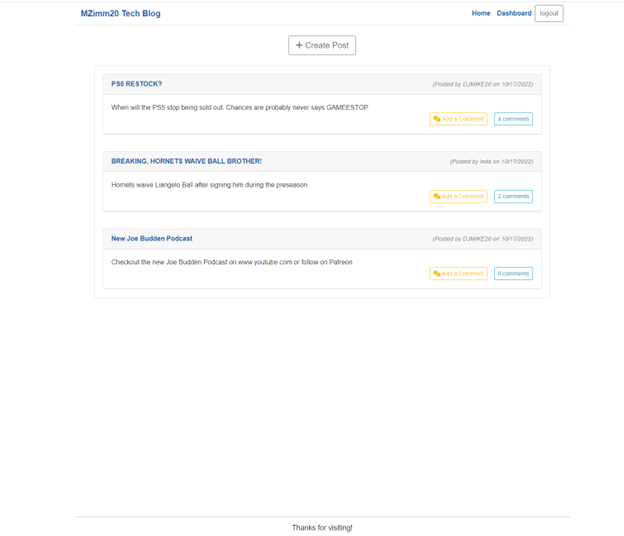
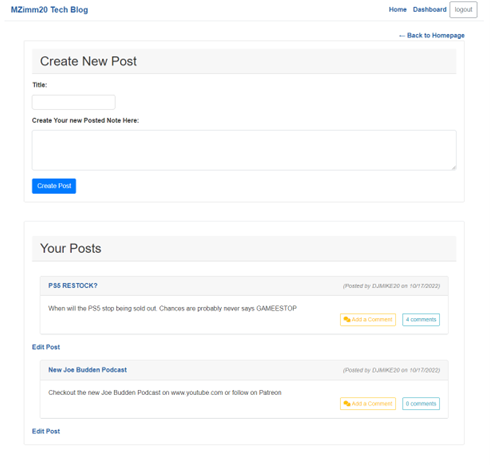
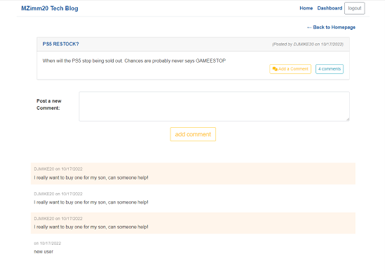
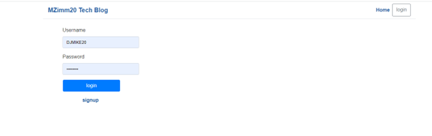
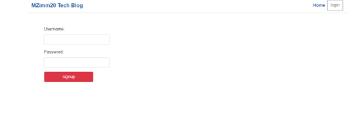

# Tech-blog

## Description
```
An application that utilizes Sequelize, dotenv, Express, JawsDB, MySQL2, bcrypt, connect-session-sequelize, express-handlebars, express-session to produce connections, routes, and models in the Tech Blog Application. It also utilizes express api and sequelize to allow a database to get all, get by id, post/create, put/update, delete/destroy specific data from the database. Using sequelize you are also able to seed the database with javascript rather writing sql queries. Using Handlebars, you are able to write unique html to link to front end javascript to render a webpage. The primary functionality of the application starts within the terminal to start the server and further using localhost specific webpages to access and navigate the site. The application allows users to create new blog post, new comments. update posts and comments, user authentication and login/logout capabilities using bcrypt, session etc, as well as deleting psots functionality. Since the application will deployed locally and through heroku. Extended back-end testing can be done using Insomnia.
  ```

  ## Table of Contents 
  * [Installation](#installation)
  * [Usage](#usage)
  * [Important-Links](#Important-Links)
  * [Questions](#questions)

  ## Installation
  * Ensure you are in your root folder,then open terminal and clone code from github. Then run these in the command terminal:

    * Next, run "npm init " to install packages 
    To shortcut and install all the necessary dependencies and packages use "npm i" followed by all the package names with a space in between each one 
    * MySQL2 Setup - "npm install --save mysql2"
    * Express Setup - "npm i express" 
    * dotenv Setup - "npm i dotenv" 
    * Sequelize Setup - "npm i sequelize" 
    * connect-session-sequelize Setup - "npm i connect-session-sequelize"
    * express-handlebars Setup - "npm i express-handlebars"
    * bcrypt Setup - "npm i bcrypt"
    * jawsDB Setup - is Through Heroku, be sure to have a card on your account (you will not be charged). > navigate to the app you created in heroku dashboard, click on it > Click on resources, then go down to search bar for Add-Ons and add JawsDB
    * Be sure to run the above packages in your terminal and include your require statements for your necessary files.
    * Don't forget to create your connections to sequelize using jawsDB


    ## Usage
  * Firstly, open the terminal 
  * Start the server with "npm start"
  * The server will run and start in the terminal, when presented with "now listening !", your server has successfully been started
  * Open http://localhost:3001/ or in heroku  https://tech-blog-max-pro.herokuapp.com/ .
  * When the user is satisfied with site functionality, they can exit the terminal using the short-cut on the keyboard : Ctrl + C


  
 <br/><br/>

 <br/><br/>
 
 <br/><br/>
  
 <br/><br/>
  
 <br/><br/>


 ## Important Links 
* GitHub Link: https://github.com/MichaelZimm20/Tech-Blog

* Heroku Link: https://tech-blog-max-pro.herokuapp.com/


## Questions 
  If you have any questions or concerns, contact:
  * GitHub: [MichaelZimm20](https://github.com/MichaelZimm20)